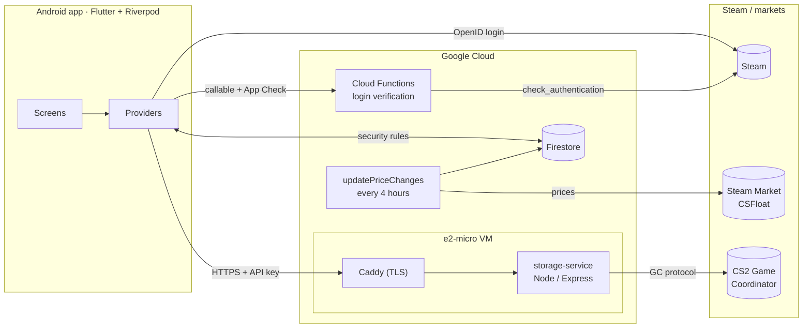

# CS2 Portfolio Manager

[](https://github.com/HAK978/de_portfolio/actions/workflows/ci.yml)

An Android app (Flutter) that tracks what a Counter-Strike 2 inventory is
worth, including the items hidden inside **storage units**, which no Steam
web API exposes. Prices come from the Steam Community Market and CSFloat,
and are refreshed server-side every four hours with 24h / 7d / 30d changes.

The project spans a mobile app, a Firebase backend and a small always-on
service that speaks Valve's Game Coordinator protocol, with tests and CI
for each part.

**Download:** the signed APK for each version is on the
[Releases](https://github.com/HAK978/de_portfolio/releases) page.

## Features

- **Steam sign-in** through Steam's own OpenID page. The login is verified
  server-side before a Firebase session is issued.
- **Inventory**: paginated fetch from Steam, local cache, and Firestore
  sync that reconciles against the server copy.
- **Prices**: Steam Market and CSFloat side by side, a server refresh every
  4 hours, 24h / 7d / 30d changes and a filterable "Top Movers" list.
- **Price history charts** with zoom, pan and a minimap, converted to USD
  from whatever currency the Steam wallet uses.
- **Storage units**: contents and per-item float values, read from the CS2
  Game Coordinator by the storage service.
- **Search** across the full CS2 item catalog with rarity, collection and
  wear filters, plus side-by-side price comparison.
- **In-app updates**: Settings → Check for updates downloads the newest
  release from GitHub, verifies its SHA-256, and opens Android's
  installer.

## Architecture



| Part | Where | What it does |
|---|---|---|
| App | [`lib/`](lib) | Flutter UI, Riverpod state, Steam/CSFloat clients, local caches |
| Cloud Functions | [`functions/`](functions) | Steam login verification → Firebase custom tokens; scheduled price refresh |
| Firestore rules | [`firestore.rules`](firestore.rules) | Per-user data, server-only collections, deny by default |
| Storage service | [`storage-service/`](storage-service) | Logged-in Steam client that reads storage units from the Game Coordinator |
| Infrastructure | [`terraform/`](terraform), [`grafana/`](grafana) | VM, static IP and firewall; Prometheus metrics dashboard |
| CI/CD | [`.github/workflows/`](.github/workflows) | Tests on every push, signed APK on tags, tested deploys to the VM |

## Design decisions

**Why a separate service for storage units.** Storage-unit contents only
exist in the Game Coordinator protocol, which needs a logged-in Steam
client. A tiny always-on VM keeps that session and exposes a small HTTPS
API. It only joins the Game Coordinator while serving a request, so the
account doesn't accrue fake playtime, and it steps aside when the real
game is running.

**Why it's single-tenant.** Serving other users would mean holding their
Steam refresh tokens on one server: a Steam ToS problem, an IP-flagging
problem, and one breach away from N stolen accounts. The trade-offs are
written up in [MULTI_TENANT_NOTES.md](MULTI_TENANT_NOTES.md).

**Why login is verified server-side.** App Check proves a request comes
from the real app, not that the user owns a Steam account. The backend
issues a one-time login session and verifies Steam's signed OpenID
assertion with Steam itself (`check_authentication`). Only then does it
mint a Firebase token, with a `steamVerified` claim the security rules
require.

**Why prices are refreshed on the server.** One scheduled job keeps
prices fresh whether or not the app is open. It respects Steam's rate
limits from a single place, and computes changes from timestamped
samples instead of the phone's patchy history.

## Security

- Secrets on the phone (Steam session cookie, API keys) live in the
  Android Keystore, and app backups are disabled.
- The storage service refuses to start without an API key and compares
  keys in constant time. It only listens on localhost behind Caddy, and
  validates input before touching the Game Coordinator.
- Firestore rules are deny-by-default and tested against the emulator:
  per-user data, owner-only shared writes, server-only collections.
- Deploys verify the VM's SSH host key, and third-party GitHub Actions
  that see secrets are pinned to commit SHAs.
- The in-app updater only downloads this repo's release assets, and only
  installs an APK whose checksum matches. Android refuses any update not
  signed with the release key.

## Testing

| Suite | Command | Covers |
|---|---|---|
| Flutter | `flutter test` | Models, sync reconciliation, price math, currency conversion, secure-storage migration, API clients (mocked HTTP), provider behavior |
| Functions (unit) | `cd functions && npm test` | OpenID assertion checks, price-history math, refresh ordering |
| Functions (emulator) | `cd functions && npm run test:emulator` | Firestore security rules, the login flow end to end, the scheduled refresh |
| Storage service | `cd storage-service && npm test` | HTTP routes, auth, input validation, token persistence, item naming |

CI runs every suite on each push and pull request. The emulator suite
needs Java 21.

## Running it locally

```bash
# App (Firebase config for the Android app is in the repo)
flutter pub get
flutter run

# Cloud Functions
cd functions && npm ci && npm test && npm run test:emulator

# Storage service (needs a Steam account; prompts for a one-time login)
cd storage-service && npm ci && npm test
ALLOW_NO_AUTH=1 node index.js
```

Deployment notes for the VM are in
[storage-service/DEPLOY.md](storage-service/DEPLOY.md). Debug builds need
an App Check debug token registered in the Firebase console
([functions/APP_CHECK_DEPLOY.md](functions/APP_CHECK_DEPLOY.md)).

## Tech stack

Flutter 3.38 · Dart 3.10 · Riverpod 3 · go_router · fl_chart · Firebase
(Auth, Firestore, Cloud Functions v2, App Check) · TypeScript · Node 22 ·
Express · steam-user / globaloffensive · Caddy · Google Compute Engine ·
Terraform · Prometheus / Grafana · GitHub Actions

## Roadmap

- Push notifications for big price moves (Firebase Cloud Messaging)
- Server-side pricing for storage-unit items, not just the inventory
